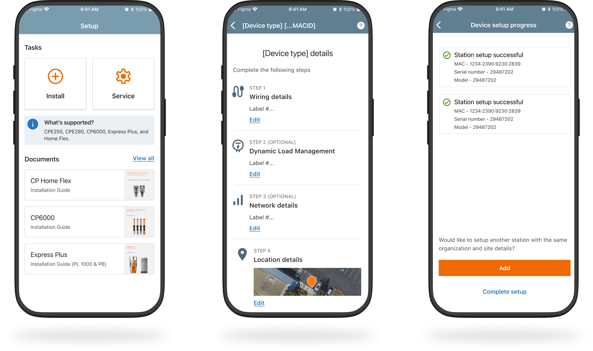

# Installer App

**Connecting the field to the platform — an end-to-end self-serve installation native mobile app.**

| | |
|---|---|
| **Role** | Lead UX/UI Designer |
| **Duration** | 6 months · 2 iterations |
| **Domain** | B2B SaaS · Native Mobile |
| **Client** | ChargePoint |
| **Year** | 2025 |

---

## Context

ChargePoint had shifted from direct sales to a Value-Added Reseller model, with roughly 90% of sales now flowing through partners like EATON. But the activation workflow never adapted to that change. Electricians deployed hardware in the field using the Installer App, while org admins managed everything post-install in Polaris Suite — two systems that didn't talk to each other.

---

## The problem

Because the field app and the platform never shared a clean data handoff, every activation stalled at the seam between them.

- Stations arrived on the platform with no owner attached — nothing linked a deployed device to the organization that bought it.
- A Customer Experience agent had to step in on every activation to manually connect stations to their owners.
- What should have been a premium, self-serve experience became recurring operational overhead.

---

## Iteration 1 — MVP

I started by mapping the data handoff between field and platform end to end. That surfaced the gaps in the flow, and the first release closed them with a set of upstream declarations that let an activation route itself.

- Site-level grouping, so stations installed together stay together.
- Upfront device configuration captured in the field instead of reconstructed later.
- Org pre-assignment pulled from Salesforce to attach an owner early.
- Email-triggered activation that hands the owner a direct link to finish setup.

> **Design decision**
> I added a gatekeeping CMS-selection step before the activation email could fire. It costs the installer one extra tap, but it prevents activation emails from being misrouted to the wrong owner — the single most expensive failure in the old flow.

**Screens**

- `create-site.png` — Create a site: grouping stations by location up front.
- `station-config.png` — Device configuration captured in the field, step by step.
- `email-activation.png` — Email-triggered activation: the owner receives a regional link and station table that deep-links into Polaris Suite.

---

## Iteration 2 — Refinement

The MVP leaned on Salesforce org data that turned out to be missing in about 30% of VAR transactions. So the second iteration removed that dependency entirely and let the installation complete cleanly on its own, with the org following afterward.

- Org-agnostic completion — the installer can skip organization details and still finish successfully.
- A Job Summary screen that consolidates multiple stations into a single submission.
- A loop-back path so installers can keep clustering more devices before submitting.
- Regional self-activation links sent to admins once the job is done.

**Screens**

- `skip-org.png` — Org-agnostic flow: the installer can skip Salesforce-dependent org data.
- `summary-one-station.png` — Setup complete: full system detail sent back to ChargePoint.
- `summary-cluster.png` — Job Summary: multiple stations rolled into one submission.
- `loop-or-submit.png` — Loop back to add another station, or complete the job.
- `summary-drawer.png` — Cluster summary with a node-detail drawer for multi-port stations.

---

## Outcome

The handoff between field deployment and platform management became a single, unified data flow. White-glove service stopped being operational overhead and became a genuine premium offering — the system now supports two clean activation routes: an enterprise API path and a VAR email path.

| Metric | |
|---|---|
| **Zero** | CX touches on the self-serve path |
| **~30%** | VAR Salesforce gap designed out |
| **2** | clean activation routes |

**Screens**

- `station-management.png` — Polaris Suite: stations arrive queued for activation at the org level, with a manual add path as a fallback.
- `success.png` — Installation confirmed in the field.

---

## What I learned

The hardest problem here wasn't a screen — it was the invisible seam between two systems and two very different users. Designing the data handoff mattered more than any single interface. And removing a dependency the flow couldn't rely on (Salesforce org data) did more for reliability than any feature I could have added on top of it.
